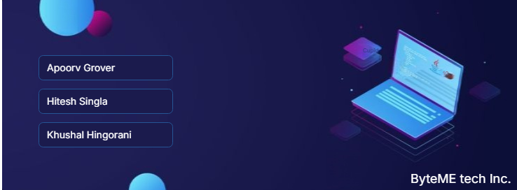

# ⚙️ P&ID Diagram Detection with MCP Servers

A next-gen web application that brings intelligent Piping & Instrumentation Diagram (P&ID) detection to life — powered by MCP servers, with a snappy UI built using Vite + React + TypeScript, and styled with Tailwind CSS + shadcn/ui.
🌐 Live Project

## 🚀 Features

    🔍 AI-powered P&ID Diagram Analysis

    📡 Real-time interaction with MCP Servers

    🧠 Smart feedback and error detection in industrial diagrams

    💬 Integrated chatbot for real-time assistance

    🛠️ Built with modern tech (Vite, React, TypeScript, Tailwind, shadcn-ui)

## 🛠 Tech Stack
Tech	Usage
⚡ Vite	Lightning-fast dev environment
⚛️ React	UI components & SPA structure
🟦 TypeScript	Static typing + better DX
🎨 Tailwind	Utility-first CSS framework
💬 shadcn/ui	Modern component library
🔌 MCP Server	Backend detection + response
🧑‍💻 How to Run Locally

# 💾 Backend

    The backend powers the core logic of P&ID Diagram Detection with MCP Servers, handling image processing, AI detection, and server communication.

## 🛠️ Tech Stack:

    Node.js – Runtime environment

    Express.js – Web framework

    MongoDB – Database for storing diagrams and results

    Multer – For handling image uploads

    TensorFlow.js / Custom ML Model – For AI-based diagram detection

    JWT & Cookies – For authentication (if used)

    MCP Integration – For real-time communication with MCP servers

 
## 🚀 How to Run Backend:

# Navigate to backend folder
cd backend

# Install dependencies
npm install

# Start the server
npm run dev

Your app should now be running at http://localhost:3000

# 🎨 Frontend

    The frontend provides an intuitive and modern UI for uploading P&ID diagrams, visualizing detection results, and interacting with the MCP server.

## 🌐 Tech Stack:

    React + TypeScript – Component-based UI with type safety

    Vite – Super fast dev server & bundler

    Tailwind CSS – Utility-first CSS framework

    shadcn/ui – Beautiful, accessible component library

    React Router – For navigation

    Axios / Fetch – For API calls

    
## 🚀 How to Run Frontend:

# Navigate to frontend folder
cd frontend

# Install dependencies
npm install

# Start the dev server
npm run dev

Your app should now be running at http://localhost:8080

